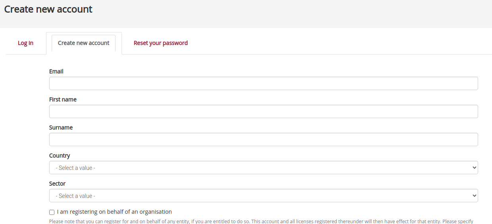

En el tutorial les propondremos hacer ejercicios en sus propias computadoras, por eso te pedimos que sigas las siguientes instrucciones para tener todo listo ese día.

# Paquetes:

Durante este tutorial usaremos una serie de paquetes. Es posible que ya tengas algunos instalados, pero es importante que te asegures de tenerlos todos. Te sugerimos que corras las siguientes líneas de código y luego pruebes cargas las librerías.

``` {.r}
paquetes <- c("metR", "ecmwfr", "ggplot2", "data.table", "ggperiodic", "ggnewscale")
install.packages(paquetes)
```

Vamos a trabajar con un tipo de archivo particular, los NetCDF4. Para leer archivos NetCDF4 es necesario instalar los paquetes {ncdf4} y {udunits2}. 

En linux, estos paquetes dependen de las librerías de sistema netcdf y udunits-2 respectivamente. En Ubuntu y derivados, se pueden instalar con:

```{·bash}
sudo apt install libnetcdf-dev netcdf-bin libudunits2-dev
```

En windowns no es necesario que instales ningún programa o librería extra. 

Finalmente, podrás instalar los paquetes de R con:

``` {.r}
install.packages(c("udunits2", "ncdf4"))
```

Como nuestro planeta es una esfera, es útil poder proyectar los datos a coordenadas que no sean sólo latitud/longitud. Para eso vamos a usar el packete {proj4}, que depende de la librería de systema proj. Nuevamente, en ubuntu y derivados se puede instalar con:

```{·bash}
sudo apt install proj-bin
```

(Instrucciones para otros sistemas operativos [en la página del proyecto](https://proj.org/install.html))

Y luego instalar el paquete de R con:

``` {.r}
install.packages("proj4")
```


# Cuentas

Vamos a usar el paquete [ecmwfr](https://bluegreen-labs.github.io/ecmwfr/) para descargar datos climáticos. 
El mismo permite hacer pedidos de datos a varios servicios, en este tutorial vamos a usar el Climate Data Store. 

Para descargar datos climáticos del Climate Data Store primero hay que tener una cuenta. 
Si no tenés una, creala en <https://cds.climate.copernicus.eu/user/register>.



Una vez que tengas tu usuario y contraseña, hay que setear las credenciales en R.
Andá a [tu perfil de usuario](https://cds.climate.copernicus.eu/user/login?destination=user) y abajo de todo vas a ver una sección con título "API Key" con dos valores: tu UID (User ID) y tu API Key. 


Si estás trabajando en una cuenta de **RStudio Cloud**, antes de lo que viene corré esta línea:


```{.r}
options(keyring_backend = "env")
```

Ahora corré este código en R, reemplazando `<UID>` por tu UID y `<API Key>` con tu APi Key:

```{.r}
ecmwfr::wf_set_key(service = "cds", user = "<UID>", key = "<API Key>")
```

Si todo sale bien, la función va a devolver un mensaje como este:

```
User <UID> for cds service added successfully in keychain
```

Finalmente, hay que aceptar los términos y condiciones de uso del servicio. 
Entrá a [este link](https://cds.climate.copernicus.eu/cdsapp/#!/terms/licence-to-use-copernicus-products) y poné aceptar abajo de todo. 

# ¿Funcionó?

Finalmente, para probar que todo se instaló correctamente, corré este pequeño "Hello, world!"


```{·r}
request <- list(
  format = "netcdf",
  product_type = "monthly_averaged_reanalysis",
  variable = "temperature",
  pressure_level = "500",
  year = "2021",
  month = "01",
  time = "00:00",
  dataset_short_name = "reanalysis-era5-pressure-levels-monthly-means",
  target = "download.nc"
)

data <- ecmwfr::wf_request(request)
metR::ReadNetCDF(data, vars = "t")
```

Primero deberías ver algo como esto:

```
Requesting data to the cds service with username 11343
- staging data transfer at url endpoint or request id:
  xxxxxxx-xxxxxx-xxxx-xxxx-xxxxxxxx

- timeout set to 1.0 hours
| polling server for a data transfer
```

Esto indica que el pedido de datos se envió al servicio y éste lo está procesando. 
Luego de unos segundos, va a empezar a descargar:

```
Downloading file
  |===========================================================| 100%
- file not copied and removed (path == tempdir())
- request purged from queue!
```

Y luego de que los datos se descarguen, la última línea leerá los datos y como resultado verás:

```
               time latitude longitude        t
      1: 2021-01-01       90      0.00 233.5851
      2: 2021-01-01       90      0.25 233.5851
      3: 2021-01-01       90      0.50 233.5851
      4: 2021-01-01       90      0.75 233.5851
      5: 2021-01-01       90      1.00 233.5851
     ---                                       
1038236: 2021-01-01      -90    358.75 237.5989
1038237: 2021-01-01      -90    359.00 237.5989
1038238: 2021-01-01      -90    359.25 237.5989
1038239: 2021-01-01      -90    359.50 237.5989
1038240: 2021-01-01      -90    359.75 237.5989
```


Si salió todo bien, ¡ya está todo listo para el tutorial!


# Plan B

Si no lográs que funcione o preferís no instalar los paquetes en tu computadora, podés usar [este proyecto de RStudio Cloud](https://rstudio.cloud/project/2679681), donde dejamos todos los paquetes instalados. Tené encuenta que necesitarás una cuenta en RStudio Cloud (la versión gratuita tiene sus limitaciones pero debería ser suficiente para el tutorial). Además deberás crear una cuenta en Climate Data Store y seguir los pasos de configuración en R.
